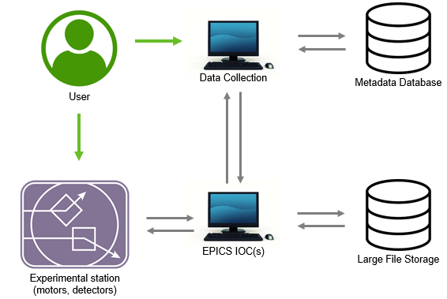

==========================================
Beamline Startup: High Throughput Hardware
==========================================

Task list and duration
======================
A rough guide to the required actions and their durations can be found below.  

+------------------------------+----------------+
| Task Name                    | Duration (hrs) |
+==============================+================+
| Remove previous installation | 3              |
+------------------------------+----------------+
| Install HiTp Frame           | 3              |
+------------------------------+----------------+
| Install Laser Range Finder   | 1              |
+------------------------------+----------------+
| Align Beam                   | 1              |
+------------------------------+----------------+
| Shift Detector forward       | 1              |
+------------------------------+----------------+
| Install I0 stage             | 1              |
+------------------------------+----------------+
| Network relevant devices     | 1              |
+------------------------------+----------------+

To accomodate these tasks, 1-2 days of FACI time is ideal.  

  Representation of communications between the various devices in the HiTp setup. 
