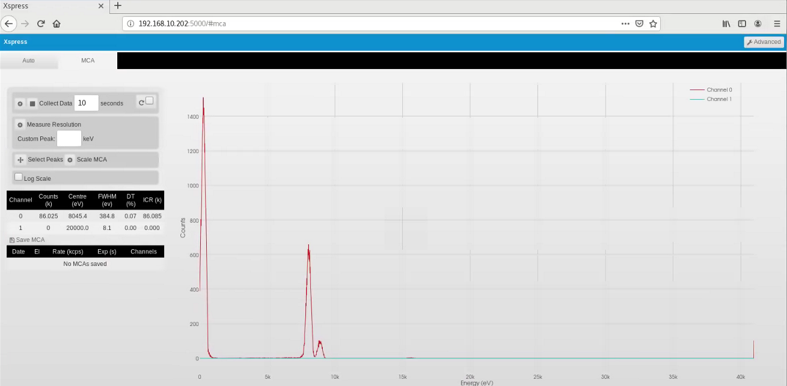

============================
Device Configuration Details
============================

This section is mostly for Beamline Support in setting up devices.  
Bluesky/EPICS relies on specific device configurations in some cases, so one may
refer here in the case of strange behavior.  

-------------------------------
Xspress3 Multi Channel Analyzer
-------------------------------
There are a plethora of options available in the Xspress 3 EPICS IOC.  The most 
relevant are listed below.  

+----------------------+--------------+
| PV name              | Setting      |
+----------------------+--------------+
| TriggerMode          | Internal [1] |
+----------------------+--------------+
| hdf5.file_write_mode | Stream [2]   |
+----------------------+--------------+
| NumImages            | 1            |
+----------------------+--------------+
| AcquireTime          | 5            |
+----------------------+--------------+

Calibrating the Xspress3
------------------------
The Xpress3 ships with calibration software.  With the IOC off, run ``remote.py``
in ``/usr/lib64/python2.7/site-packages/xspress3-autocalib/remote.py``.  

After some time a web page should appear with options to either collect a spectrum 
or perform autocalibration.  Once you have confirmed the xspress3 is collecting
data from a copper standard, start the calibration procedure.  This process should 
center the copper peak at 8045 eV.  

---------
Galil RIO
---------

+--------------------+-----------+
| Connection         | Channel # |
+====================+===========+
| Laser Range Finder | ``AI0``   |
+--------------------+-----------+
| I0 ion gauge       | ``AI1``   |q
+--------------------+-----------+
| I1 ion gauge       | ``AI2``   |
+--------------------+-----------+
| Shutter            | ``DO00``  |
+--------------------+-----------+
| Table Trigger      | ``DO01``  |
+--------------------+-----------+
| Filter box: 1      | ?         |
+--------------------+-----------+
| Filter box: 2      | ?         |
+--------------------+-----------+
| Filter box: 3      | ?         |
+--------------------+-----------+
| Filter box: 4      | ?         |
+--------------------+-----------+

-------------------
Motor Configuration
-------------------

+------+-----------------+---------+---------+-------+---------+-------+------------+---------+
| Name | Motor           | .VELO   | .VMAX   | .ACCL | .VBAS   | .SREV | .MRES      | .UREV   |
+------+-----------------+---------+---------+-------+---------+-------+------------+---------+
| th   | BL00:IMS:MOTOR1 | 0.5     | 62.9881 | 0.05  | 0.5     | 51200 | 1.95313e-5 | 1       |
+------+-----------------+---------+---------+-------+---------+-------+------------+---------+
| pz   | BL00:IMS:MOTOR2 | 3.14961 | 4       | 2     | 0.1     | 28565 | 3.50079e-5 | 1       |
+------+-----------------+---------+---------+-------+---------+-------+------------+---------+
| px   | BL00:IMS:MOTOR3 | 15      | 15      | 2     | 0.05    | 25600 | 3.90625e-5 | 1       |
+------+-----------------+---------+---------+-------+---------+-------+------------+---------+
| py   | BL00:IMS:MOTOR4 | 31.4961 | 31.4961 | 2     | 7.87402 | 10240 | 9.76563e-5 | 1       |
+------+-----------------+---------+---------+-------+---------+-------+------------+---------+