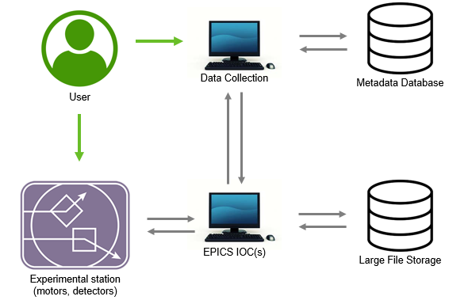

==========
Networking
==========

*Details here are current for the HiTp installation on BL1-5 as of 03/08/21.*

Data Collection Network
-----------------------

  Representation of communications between the various devices in the HiTp setup. 
  This is primarily from the point of view of data collection.  

High Throughput IP Network
--------------------------

.. figure:: images/HiTpNetwork1.png
  :width: 700
  :alt: HiTp IP Network
  
  IP networking diagram for the High Throughput system.  Note: Originally, 
  192.0.2.2 was the local IP for SPEC computers to talk to detector computers 
  – or more specifically, to map drives (EXPORT).  This was so that Pilatus 
  detectors could move between beam lines easily.  Pilatus detector computers 
  were sequentially numbered by 10's (eg. 192.0.2.10, 192.0.2.20) but that 
  scheme is no longer followed by MSD group. (ie: ... 91 instead of 90.)

EwaldPC Auxillary Network
-------------------------
.. figure:: images/EwaldPCAux.png
  :width: 700
  :alt: EWALDPC HiTp Auxillary

  Networking diagram for EwaldPC, used for HiTp Auxillary equipment