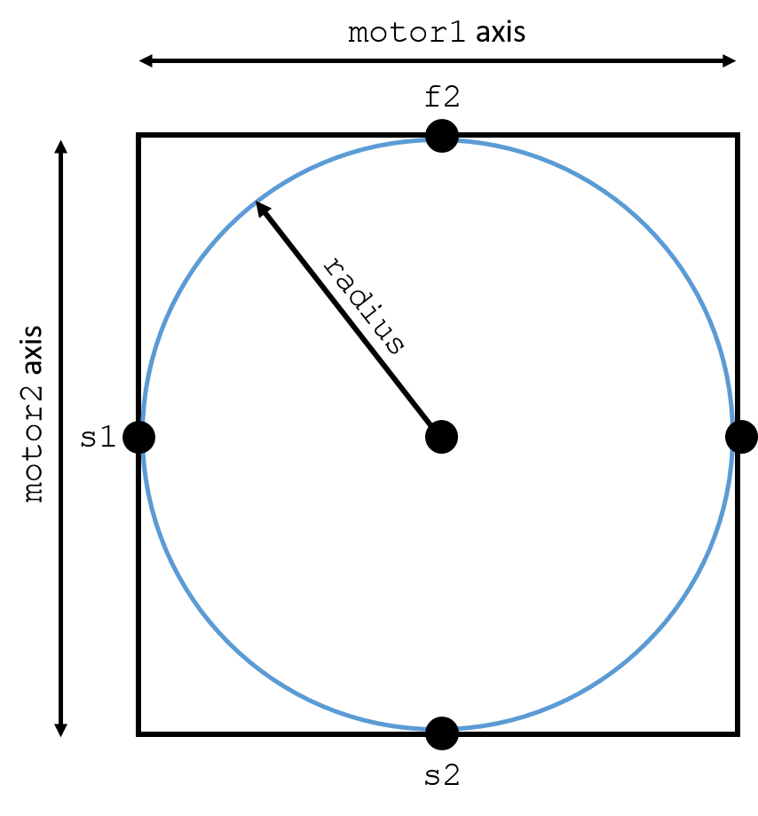

=====
Plans
=====

A variety of plans for your use.  These are built out of Bluesky 
plans_ and `plan stubs`_, and customized to be very specific to operations 
at SSRL1-5.  If you'd like to build
your own plans out of the existing plans, see this `tutorial section`_.

.. _plans:  https://blueskyproject.io/bluesky/plans.html#pre-assembled-plans
.. _plan stubs: https://blueskyproject.io/bluesky/plans.html#stub-plans
.. _tutorial section: https://nsls-ii.github.io/bluesky/tutorial.html#plans-in-series

Helper functions, plans
=======================

``show_table()``:
-----------------
Shows data from the last run in tablular from.  Providing an index (i) 
will return data from the 'i-th' run.  This is simply a wrapper for ``db[i].table()``

.. code:: ipython

    In [33]: RE(bp.count([det]))

    Transient Scan ID: 9     Time: 2020-09-03 14:32:59
    Persistent Unique Scan ID: 'a70862bd-782f-44f6-98aa-bf5328854a67'
    New stream: 'primary'
    +-----------+------------+------------+
    |   seq_num |       time |        det |
    +-----------+------------+------------+
    |         1 | 14:32:59.1 |      0.989 |
    +-----------+------------+------------+
    generator count ['a70862bd'] (scan num: 9)

    Out[33]: ('a70862bd-782f-44f6-98aa-bf5328854a67',)

    In [34]: RE(bp.scan([det], motor, -1, 1, 2))

    Transient Scan ID: 10     Time: 2020-09-03 14:33:18
    Persistent Unique Scan ID: 'b161498f-df5f-4ae0-8a77-c894a9c1a567'
    New stream: 'primary'
    +-----------+------------+------------+------------+
    |   seq_num |       time |      motor |        det |
    +-----------+------------+------------+------------+
    |         1 | 14:33:18.3 |     -1.000 |      0.607 |
    |         2 | 14:33:18.3 |      1.000 |      0.607 |
    +-----------+------------+------------+------------+
    generator scan ['b161498f'] (scan num: 10)
    Out[34]: ('b161498f-df5f-4ae0-8a77-c894a9c1a567',)

    
    In [37]: show_table()
    Out[37]: 
                                    time       det  motor  motor_setpoint
    seq_num
    1       2020-09-03 21:33:18.330529213  0.606531   -1.0            -1.0
    2       2020-09-03 21:33:18.359466553  0.606531    1.0             1.0

    In [38]: show_table(-2) # negative indexes walk from most recent to least
    Out[38]: 
                                    time       det
    seq_num
    1       2020-09-03 21:32:59.126556158  0.988639

``show_image()``:
-----------------
Shows last marCCD image, simple wrapper function around databroker call.  
Sets heat map scale to (min, mean+3*std).  Defaults to first marccd data point 
in most recent scan, but allows for customization.

.. code:: ipython 

    In [1]: show_image(ind=-1, data_pt=1, img_key='marCCD_image') #these are the default parameters

``tune(signal, axis)`` : 
------------------------
Tunes a motor based on output from a signal.  A width and number of steps can be
specified.  After scanning the motor from ``-width/2`` to ``+width/2`` relative
to the current position, the motor will be moved to either the center of mass 
('com') or midpoint between half-max points ('cen').  

Default parameters are provided for some motors, otherwise parameters must be
supplied as arguments. 

Signature: 
``tune(signal, motor, width=None, num=None, peak_choice=None, md=None)``

.. code:: ipython

    In [5]: RE(bps.mv(motor, 1))
    Out[5]: ()

    In [6]: RE(tune(det, motor))

    Transient Scan ID: 3     Time: 2020-09-03 15:14:19
    Persistent Unique Scan ID: '1a2e178d-89b0-4256-a6ed-7b6ea987e336'
    New stream: 'primary'
    +-----------+------------+------------+------------+
    |   seq_num |       time |      motor |        det |
    +-----------+------------+------------+------------+
    |         1 | 15:14:19.3 |     -1.000 |      0.607 |
    |         2 | 15:14:19.4 |     -0.789 |      0.732 |
    |         3 | 15:14:19.4 |     -0.579 |      0.846 |
    |         4 | 15:14:19.4 |     -0.368 |      0.934 |
    |         5 | 15:14:19.4 |     -0.158 |      0.988 |
    |         6 | 15:14:19.4 |      0.053 |      0.999 |
    |         7 | 15:14:19.5 |      0.263 |      0.966 |
    |         8 | 15:14:19.5 |      0.474 |      0.894 |
    |         9 | 15:14:19.5 |      0.684 |      0.791 |
    |        10 | 15:14:19.5 |      0.895 |      0.670 |
    |        11 | 15:14:19.6 |      1.105 |      0.543 |
    |        12 | 15:14:19.6 |      1.316 |      0.421 |
    |        13 | 15:14:19.6 |      1.526 |      0.312 |
    |        14 | 15:14:19.7 |      1.737 |      0.221 |
    |        15 | 15:14:19.7 |      1.947 |      0.150 |
    |        16 | 15:14:19.7 |      2.158 |      0.097 |
    |        17 | 15:14:19.8 |      2.368 |      0.061 |
    |        18 | 15:14:19.8 |      2.579 |      0.036 |
    |        19 | 15:14:19.8 |      2.789 |      0.020 |
    |        20 | 15:14:19.8 |      3.000 |      0.011 |
    +-----------+------------+------------+------------+
    generator motor.tune ['1a2e178d'] (scan num: 3)
    Out[6]: ('1a2e178d-89b0-4256-a6ed-7b6ea987e336',)

    In [7]: motor.position
    Out[7]: 0.2466375712535196

High Throughput (HiTp) specific plans
=====================================

``loc_177_scan(dets)``
----------------------
Macro for automatically scanning a HiTp library with 177 points.  Currently this
plan does not take any dark-field images.  ``dets`` is a list of detectors

.. code:: ipython

    In [7]: RE(loc_177_scan([dexDet, xsp3]))

``dark_light_plan(dets, shutter)``
----------------------------------
Simple acquisition plan for a single point.  Closes the shutter, takes a dark 
image, opens the shutter, and finally takes a light image.  Both images are 
referenced in the same run, under the metadata tag: ``im_type``.  Returns the 
uid of each image.  

.. code:: ipython

    In [1]: uids = RE(dark_light_plan([dexDet], shutter))

.. exp_time_plan
.. multi_acquire plan

``level_stage_single``
----------------------

as of the writing of this passage (09/20/2020), the single wafer stage can be 
leveled via the following commands

.. code-block:: ipython

    In [19]: RE(level_stage_single(lrf, s_stage.vx, s_stage.px, -50, 50))

    In [19]: RE(level_stage_single(lrf, s_stage.vy, s_stage.py, 60, -60))

``mesh_grid_circ``
------------------
Scans points in a circular grid with given radius.  Scan bounds is defined by a 
4 endpoints ``(s1, f1, s2, f2)``.  A measurement is taken at every point within 
the bounds defined by these endpoints *if* that point is inside the radius.  

To align the grid within the circular boundary, a sample location can be provided to 
the ``pin`` variable.  If no ``pin`` is provied, then the current location is 
used.  

In the case where a scan has been interrupted after the first n measurements, 
one can supply a number of measurements to skip.  

The order of the motors controls how the grid is traversed. The "slowest" axis 
comes first, and only scans between its limits once.  The second "faster" axis 
will scan betwen its limits once for each position on the first motor.  
This plan uses the ``blueksy.plans.grid_scan`` behavior, and one can reference 
its more complete documentation_.

.. _documentation: https://nsls-ii.github.io/bluesky/tutorial.html#scan-multiple-motors-in-a-grid

.. code:: ipython

    In [2]: RE(mesh_circ_grid([marDet], s_stage.px, -10, 10, 4.5, 
                                    s_stage.py, -10, 10, 4.5, 
                                    radius=10, pin=(1.5, 1.5), skip=4 ))
